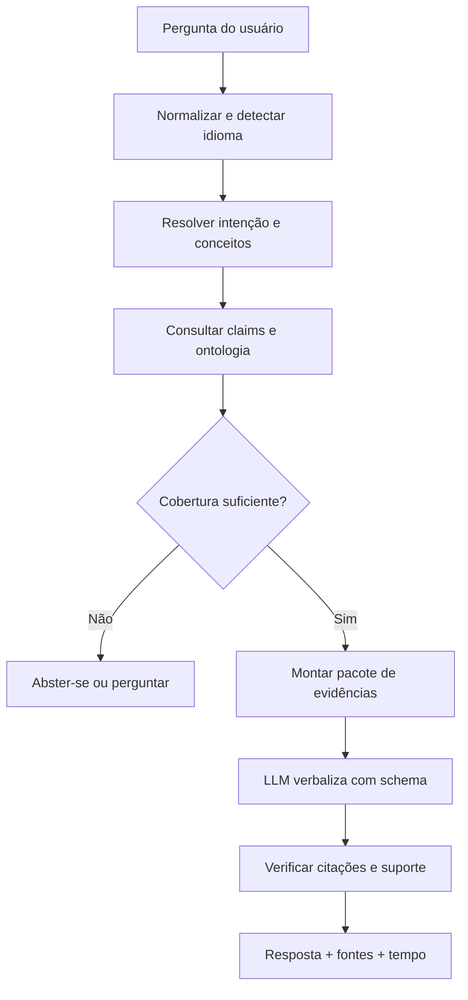
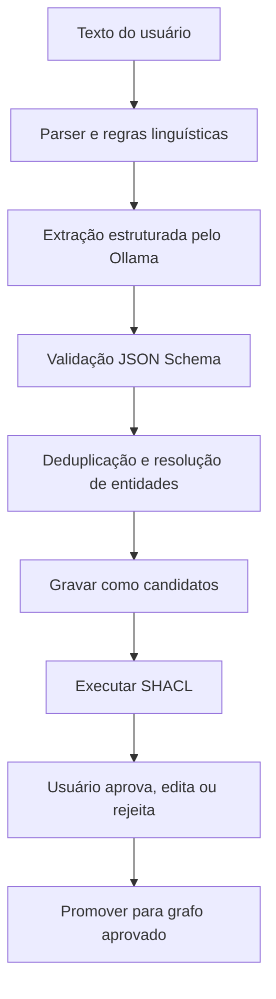

# Blueprint de implementação

## Knowledge graph Arcadia + Ollama local + validação do modelo do usuário

## 1. Resposta direta

Sim, a arquitetura é viável. Ela deve ser implementada como **graph-grounded assistance**, e não como uma conversa livre com uma LLM que “conhece Arcadia”.

O núcleo confiável é:

- ontologia RDF/OWL;
- afirmações atômicas com proveniência;
- consultas SPARQL;
- regras SHACL;
- aprovação e versionamento do usuário.

A LLM local via Ollama desempenha funções auxiliares:

- classificar a intenção da pergunta;
- mapear linguagem do usuário para conceitos do grafo;
- extrair candidatos de textos não estruturados;
- verbalizar o conjunto de evidências retornado;
- sugerir perguntas de esclarecimento.

Ela não decide silenciosamente o conteúdo do modelo e não é aceita como fonte factual.

---

## 2. Organização dos dados

Use um RDF Dataset com grafos nomeados:

| Named graph | Conteúdo | Autoridade |
|---|---|---|
| `urn:graph:ontology` | classes, propriedades e axiomas | controlada/versionada |
| `urn:graph:arcadia-reference` | claims, definições, FAQs e fontes | curadoria Arcadia |
| `urn:graph:arcadia-shapes` | shapes SHACL | regras de qualidade |
| `urn:graph:project-approved` | elementos aprovados pelo usuário | verdade do projeto |
| `urn:graph:project-candidates` | extrações ainda não aprovadas | hipótese |
| `urn:graph:validation` | resultados de validação | derivado |
| `urn:graph:audit` | autor, timestamp, mudanças e decisões | trilha de auditoria |

Não misture `project-candidates` com `project-approved`. Essa separação é indispensável para impedir que a aplicação trate uma sugestão da LLM como fato aceito.

Cada instância aprovada deve receber dois tipos RDF: `oa:ProjectElement` e seu tipo Arcadia específico. Exemplo: `ex:activity-17 a oa:ProjectElement, oa:OperationalActivity`. O primeiro ativa regras comuns de ID/nome; o segundo ativa as regras semânticas da classe.

---

## 3. Componentes recomendados

Para a primeira versão local, sem dependência de um servidor de grafo:

- Python;
- `rdflib` para RDF e SPARQL;
- `pyshacl` para validação;
- Ollama via API HTTP local;
- Pydantic/JSON Schema para estruturas de entrada e saída;
- índice lexical local simples para recuperar claims por texto/intenção.

Um triplestore dedicado (RDF4J, Jena/Fuseki, GraphDB etc.) só é necessário quando tamanho, concorrência, inferência ou governança justificarem. Manter RDF/SPARQL/SHACL desde o início preserva portabilidade.

### Dependências mínimas sugeridas

```text
rdflib
pyshacl
pydantic
httpx
```

O nome do modelo Ollama **não deve estar hardcoded**. Obtenha-o de:

1. seleção do usuário na interface;
2. configuração persistida do projeto; ou
3. variável de ambiente, por exemplo `OLLAMA_MODEL`.

Se nenhum modelo estiver configurado, a aplicação deve listar modelos disponíveis pela API do Ollama e pedir seleção. Não escolha silenciosamente um modelo fixo.

---

## 4. Pipeline de perguntas e respostas



### 4.1 Normalização

- preservar texto original;
- criar versão normalizada apenas para busca;
- detectar termos Arcadia em português e inglês;
- identificar IDs do modelo mencionados;
- não remover negação, modalidade, quantidades ou unidades.

### 4.2 Resolução de intenção

Primeiro, tente métodos sem LLM:

- aliases explícitos: “o que é ator operacional” → `define_operational_actor`;
- busca pelos valores de `oa:answersIntent`;
- busca lexical em `oa:assertionText`, labels e definições SKOS;
- correspondência por ID/nome do Project Graph.

Use a LLM somente quando a consulta for ambígua. A saída deve obedecer a JSON Schema:

```json
{
  "intent": "actor_vs_entity",
  "concept_iris": [
    "https://github.com/fabricionicolato1323-cyber/MBSE-App/knowledge/arcadia/oa#OperationalActor",
    "https://github.com/fabricionicolato1323-cyber/MBSE-App/knowledge/arcadia/oa#OperationalEntity"
  ],
  "project_element_ids": [],
  "needs_clarification": false,
  "clarification_question": null
}
```

### 4.3 Recuperação

Recupere claims por intenção, conceitos e relações. Nunca entregue o arquivo inteiro à LLM por padrão. O pacote deve ser pequeno, explícito e rastreável.

Exemplo SPARQL:

```sparql
PREFIX oa: <https://github.com/fabricionicolato1323-cyber/MBSE-App/knowledge/arcadia/oa#>
PREFIX prov: <http://www.w3.org/ns/prov#>
PREFIX dcterms: <http://purl.org/dc/terms/>

SELECT ?claim ?text ?status ?source ?locator
WHERE {
  ?claim a oa:KnowledgeClaim ;
         oa:answersIntent "actor_vs_entity" ;
         oa:assertionText ?text ;
         oa:guidanceStatus ?status .
  OPTIONAL {
    ?claim prov:wasDerivedFrom ?sourceNode .
    ?sourceNode dcterms:source ?source .
  }
  OPTIONAL { ?claim oa:sourceLocator ?locator . }
}
ORDER BY ?claim
```

### 4.4 Pacote de evidências

Formato recomendado:

```json
{
  "question": "Qual a diferença entre ator e entidade?",
  "coverage": "SUPPORTED",
  "evidence": [
    {
      "claim_id": "CLAIM-OA-ACTOR-001",
      "text": "Um ator operacional é uma entidade operacional não decomponível, usualmente humana.",
      "status": "ARCADIA_REFERENCE",
      "source": "SRC-ARC-MM-2023",
      "locator": "seção 4.2.3.1, p. 24"
    }
  ],
  "allowed_project_facts": []
}
```

### 4.5 Prompt de resposta

```text
ROLE
Você é a camada de verbalização de uma base de conhecimento Arcadia.

SOURCE POLICY
- Use somente as afirmações presentes em EVIDENCE.
- Não complete lacunas com conhecimento próprio.
- Diferencie ARCADIA_REFERENCE, MODELING_RECOMMENDATION,
  APPLICATION_POLICY e LINGUISTIC_HEURISTIC.
- Cada afirmação material deve citar um ou mais claim_id.
- Se EVIDENCE não sustentar a resposta, retorne NOT_FOUND ou
  NEEDS_DOMAIN_DECISION.

TASK
Responda à pergunta de maneira clara no idioma do usuário.

OUTPUT
Obedeça exatamente ao JSON Schema fornecido.
```

### 4.6 Schema de saída

```json
{
  "coverage": "SUPPORTED",
  "answer": "...",
  "citations": [
    {
      "claim_ids": ["CLAIM-OA-ACTOR-001"],
      "sentence": "..."
    }
  ],
  "open_question": null
}
```

Valores admitidos para `coverage`:

- `SUPPORTED`;
- `PARTIALLY_SUPPORTED`;
- `NOT_FOUND`;
- `CONFLICTING_EVIDENCE`;
- `NEEDS_DOMAIN_DECISION`.

### 4.7 Verificação pós-LLM

Antes de mostrar a resposta:

- todo `claim_id` existe?
- todo claim estava no pacote de evidências?
- há frase factual sem citação?
- o status foi representado corretamente?
- a resposta adicionou nome, cardinalidade, regra ou exemplo ausente?
- a resposta contradiz um claim recuperado?

Se falhar, não peça à mesma LLM para “corrigir livremente”. Gere uma resposta determinística por template ou abstenha-se.

---

## 5. Perguntas que dispensam LLM

Definições simples podem ser respondidas diretamente:

```text
{label}: {skos:definition}
Fonte: {source title}, {source locator}
Status: {guidance status}
```

Isso é mais rápido, determinístico e barato. Use a LLM para:

- combinar vários claims;
- explicar no contexto do elemento do projeto;
- reformular para diferentes níveis de conhecimento;
- propor uma pergunta de esclarecimento.

---

## 6. Pipeline de extração do texto do usuário



### 6.1 Saída de extração

```json
{
  "source_text": "A equipe avalia o incidente e informa a prioridade ao coordenador.",
  "candidates": [
    {
      "temporary_id": "cand-1",
      "suggested_type": "OperationalEntity",
      "name": "Equipe",
      "evidence_span": [2, 8],
      "confidence": 0.94,
      "alternatives": []
    },
    {
      "temporary_id": "cand-2",
      "suggested_type": "OperationalActivity",
      "name": "Avaliar incidente",
      "evidence_span": [9, 28],
      "confidence": 0.90,
      "alternatives": []
    }
  ],
  "relations": [],
  "open_questions": [
    "A equipe informa diretamente o coordenador ou existe outra atividade intermediária?"
  ],
  "elapsed_ms": 438
}
```

Confiança é um indicador operacional da extração, não probabilidade de verdade. Nunca use limiar alto para promover candidatos automaticamente sem autorização explícita.

---

## 7. Comparação com o modelo do usuário

## 7.1 Validação estrutural

Carregue `04_arcadia_oa_shapes.ttl` e execute SHACL contra `project-approved`. Exemplos:

- interação com fonte ausente → `Violation`;
- sistema de interesse na OA → `Violation`;
- ator decomponível → `Violation`;
- capacidade sem missão → `Warning`;
- atividade sem performer → `Warning`;
- item sem dados internos → `Info`.

Não bloqueie edição por causa de warnings durante a captura. Mostre progresso e permita adiar a resolução.

## 7.2 Consultas de cobertura

### Atividades sem performer

```sparql
PREFIX oa: <https://github.com/fabricionicolato1323-cyber/MBSE-App/knowledge/arcadia/oa#>
SELECT ?activity ?name
WHERE {
  ?activity a oa:OperationalActivity .
  OPTIONAL { ?activity oa:name ?name }
  FILTER NOT EXISTS { ?activity oa:performedBy ?entity }
}
```

### Capacidades sem descrição dinâmica

```sparql
PREFIX oa: <https://github.com/fabricionicolato1323-cyber/MBSE-App/knowledge/arcadia/oa#>
SELECT ?capability ?name
WHERE {
  ?capability a oa:OperationalCapability .
  OPTIONAL { ?capability oa:name ?name }
  FILTER NOT EXISTS { ?x oa:describesCapability ?capability }
}
```

### Interações cujos performers não estão ligados por meio de comunicação

```sparql
PREFIX oa: <https://github.com/fabricionicolato1323-cyber/MBSE-App/knowledge/arcadia/oa#>
SELECT ?interaction ?sourceEntity ?targetEntity
WHERE {
  ?interaction a oa:OperationalInteraction ;
               oa:sourceActivity ?sourceActivity ;
               oa:targetActivity ?targetActivity .
  ?sourceActivity oa:performedBy ?sourceEntity .
  ?targetActivity oa:performedBy ?targetEntity .
  FILTER (?sourceEntity != ?targetEntity)
  FILTER NOT EXISTS {
    ?mean a oa:CommunicationMean ;
          oa:connectsEntity ?sourceEntity, ?targetEntity ;
          oa:supportsInteraction ?interaction .
  }
}
```

Esse último resultado deve ser `Warning`, não verdade absoluta: algumas interações podem dispensar a explicitação do meio no nível de detalhe escolhido.

## 7.3 Comparação semântica

Compare os candidatos do usuário com as definições e regras:

- tipo provável versus relações presentes;
- solução prematura versus necessidade operacional;
- ator versus entidade decomponível;
- atividade versus capacidade;
- item trocado versus meio;
- dependência versus sequência temporal;
- duplicação e sinonímia;
- lacuna de responsável, conteúdo, condição ou medida.

Sempre retorne:

```json
{
  "finding_id": "F-0042",
  "severity": "WARNING",
  "project_element_id": "OA-17",
  "rule_id": "OperationalCapabilityShape",
  "message": "A capacidade não possui cenário ou processo que a descreva.",
  "evidence_claim_ids": ["CLAIM-OA-CAPABILITY-DESCRIBED-001"],
  "suggested_question": "Qual cenário mostra como esta capacidade é alcançada?",
  "auto_fix_allowed": false
}
```

---

## 8. Desempenho e medição de tempo

Meça separadamente:

- `intent_resolution_ms`;
- `graph_query_ms`;
- `llm_generation_ms`;
- `verification_ms`;
- `total_ms`.

Use relógio monotônico:

```python
from time import perf_counter

t0 = perf_counter()
# etapa
elapsed_ms = round((perf_counter() - t0) * 1000, 1)
```

Mostre ao usuário ao menos o tempo total; armazene os tempos por etapa para diagnóstico.

Otimizações:

- responder definições por template sem LLM;
- cachear resultados por versão do grafo + intenção + entidades;
- pré-indexar labels, aliases e claims;
- limitar o pacote de evidências;
- streaming apenas na verbalização, nunca antes da recuperação;
- não carregar a ontologia inteira no prompt;
- invalidar cache quando a versão do Reference Graph ou Project Graph mudar.

---

## 9. Configuração do Ollama

Exemplo de configuração externa:

```yaml
ollama:
  base_url: "http://localhost:11434"
  model: null
  temperature: 0.1
  timeout_seconds: 90
  keep_alive: "10m"
```

Regras:

- `model: null` significa “seleção necessária”, não fallback hardcoded;
- a interface lista os modelos instalados;
- a escolha é gravada por projeto/usuário;
- se o modelo for removido, pedir nova escolha;
- registrar modelo, versão/configuração, prompt version e tempo em toda execução;
- usar Structured Outputs com JSON Schema quando suportado;
- não depender de uma família específica de modelo.

---

## 10. Segurança e robustez

- Trate texto e documentos recuperados como dados, nunca como instruções para a LLM.
- Remova/escape marcações que tentem redefinir o papel do assistente.
- Restrinja SPARQL gerado pela LLM a templates parametrizados ou consultas somente leitura.
- Valide IRIs e parâmetros; não concatene texto livre em SPARQL.
- Não exponha caminhos locais, prompts internos ou dados de outros projetos.
- Use limite de tamanho e timeout.
- Mantenha audit trail de toda promoção de candidato.
- Nunca permita que a LLM altere o Reference Graph em produção.
- Atualizações da referência exigem curadoria e testes de regressão.

---

## 11. Testes de aceitação

### Perguntas de help

- definição direta retorna claim e fonte corretos;
- pergunta não coberta retorna `NOT_FOUND`;
- pergunta ambígua retorna uma pergunta curta;
- recomendação não é apresentada como regra Arcadia;
- resposta contendo claim inexistente é rejeitada;
- ausência do Ollama não impede respostas determinísticas.

### Extração

- preserva negação;
- preserva unidades e quantidades;
- detecta múltiplos verbos;
- não inventa performer para voz passiva;
- não promove candidato sem aprovação;
- mede tempo de resposta.

### Validação

- detecta sistema de interesse na OA;
- detecta ator decomposto;
- detecta interação sem fonte/destino;
- detecta capacidade órfã;
- não trata warning como bloqueio obrigatório;
- resultado aponta regra e evidência.

### Regressão epistemológica

- toda afirmação `ArcadiaReference` possui fonte;
- todo source locator é válido no documento registrado;
- nenhum exemplo de projeto está no Reference Graph como regra;
- alterações em claims incrementam versão;
- respostas antigas continuam sustentadas ou são explicitamente migradas.

---

## 12. Sequência de implementação recomendada

1. carregar e validar os três arquivos Turtle;
2. implementar respostas determinísticas por `answersIntent`;
3. implementar busca lexical e mapeamento de aliases;
4. implementar SHACL para o Project Graph;
5. implementar tela de findings e perguntas de correção;
6. integrar Ollama para desambiguação e verbalização;
7. implementar extração para `project-candidates`;
8. implementar aprovação/undo/versionamento;
9. adicionar verificador de citações;
10. criar suite de regressão com perguntas conhecidas.

Essa ordem entrega valor antes da dependência da LLM e mantém a aplicação funcional mesmo se o modelo local estiver indisponível ou lento.
