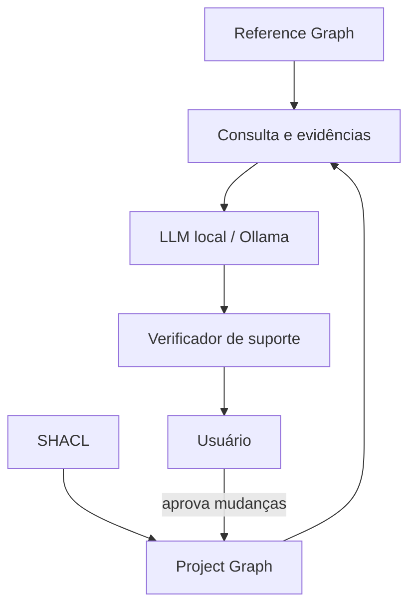

# Base de conhecimento — Análise Operacional Arcadia

Este pacote contém uma referência aprofundada e uma implementação inicial de knowledge graph para um assistente local de modelagem.

## Arquivos

1. `01_guia_analise_operacional_arcadia.md` — texto aprofundado, conceitos, relações, regras de aceitação, limites e governança.
2. `02_arcadia_oa_ontology.ttl` — vocabulário RDF/OWL com classes, propriedades, definições, estatuto e proveniência.
3. `03_arcadia_oa_reference_claims.ttl` — afirmações atômicas consultáveis para help/RAG controlado.
4. `04_arcadia_oa_shapes.ttl` — regras SHACL para comparar e validar o modelo do usuário.
5. `05_blueprint_integracao_ollama_knowledge_graph.md` — arquitetura, schemas, consultas, anti-alucinação, tempos e sequência de implementação.

## Princípio de arquitetura



O Reference Graph é a fonte autorizada para ajuda sobre Arcadia. O Project Graph contém somente dados aprovados pelo usuário. A LLM interpreta e verbaliza; ela não é aceita como fonte de verdade.

## Namespace

```text
https://github.com/fabricionicolato1323-cyber/MBSE-App/knowledge/arcadia/oa#
```

O namespace foi estabilizado sob o repositório do projeto. Mudanças incompatíveis
devem usar uma nova versão da ontologia e preservar os identificadores publicados.

## Observação jurídica e metodológica

Esta é uma formalização derivada para uso na aplicação, não uma ontologia oficial da Thales ou da Eclipse Foundation. Definições sustentadas por fonte são marcadas como `oa:ArcadiaReference`; recomendações, políticas da aplicação e heurísticas ficam separadas.
