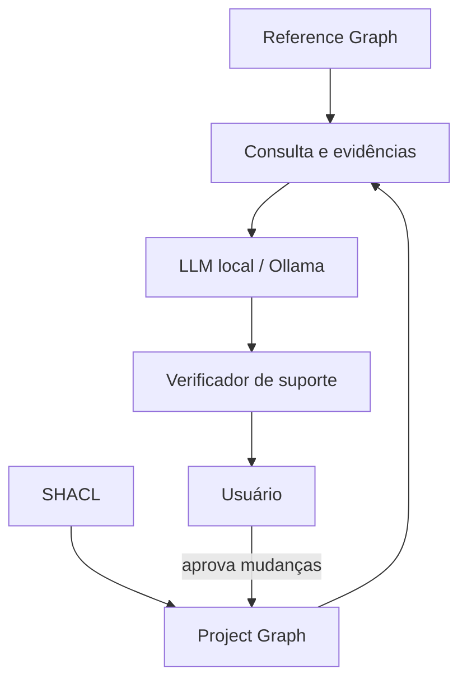

# Base de conhecimento — Análise Operacional Arcadia

Este pacote contém uma referência aprofundada e uma implementação inicial de knowledge graph para um assistente local de modelagem.

## Arquivos

1. `01_guia_analise_operacional_arcadia.md` — texto aprofundado, conceitos, relações, regras de aceitação, limites e governança.
2. `02_arcadia_oa_ontology.ttl` — vocabulário RDF/OWL com classes, propriedades, definições, estatuto e proveniência.
3. `03_arcadia_oa_reference_claims.ttl` — afirmações atômicas consultáveis para help/RAG controlado.
4. `04_arcadia_oa_shapes.ttl` — regras SHACL para comparar e validar o modelo do usuário.
5. `05_blueprint_integracao_ollama_knowledge_graph.md` — arquitetura, schemas, consultas, anti-alucinação, tempos e sequência de implementação.
6. `06_role_boundary_ontology.ttl` — extensão semântica para papel operacional, realização do papel, natureza do participante e pistas linguísticas de fronteira.
7. `07_role_boundary_claims.ttl` — políticas e evidências consultáveis sobre `role vs. realizer`, participante técnico existente e System of Interest.
8. `08_role_boundary_shapes.ttl` — regras SHACL para papel sem realizador e contaminação da OA pelo System of Interest.

## Princípio de arquitetura



O Reference Graph é a fonte autorizada para ajuda sobre Arcadia. O Project Graph contém somente dados aprovados pelo usuário. A LLM interpreta e verbaliza; ela não é aceita como fonte de verdade.

### Role realization e fronteira do sistema

A extensão de fronteira mantém quatro decisões separadas:

```text
User phrase
   ↓
Knowledge Graph lexical cue
   ↓
Role-like? ── yes ──> Who/what realizes the role?
   │                         ↓
   │                 human / existing technical / solution
   │
   └─ technical? ──> existing operational participant or solution being designed?
                             ↓
                    explicit user decision
                             ↓
                    approved Project Graph only
```

Palavras como `manager`, `controller` e `operator` são armazenadas no KG como **heurísticas linguísticas**, não como prova de que o elemento seja humano. Do mesmo modo, palavras como `system`, `device` e `platform` apenas abrem uma decisão de fronteira. O System of Interest continua proibido na Operational Analysis.

Quando um participante aprovado realiza um papel, a projeção RDF cria uma relação derivada `oa:realizesRole`. A natureza confirmada do participante também é projetada via `oa:hasParticipantNature`. Isso permite que SHACL e o Next Best Question Engine consumam semântica mais rica sem transferir autoridade de escrita para o Knowledge Graph.

## Namespace

```text
https://github.com/fabricionicolato1323-cyber/MBSE-App/knowledge/arcadia/oa#
```

O namespace foi estabilizado sob o repositório do projeto. Mudanças incompatíveis
devem usar uma nova versão da ontologia e preservar os identificadores publicados.

## Observação jurídica e metodológica

Esta é uma formalização derivada para uso na aplicação, não uma ontologia oficial da Thales ou da Eclipse Foundation. Definições sustentadas por fonte são marcadas como `oa:ArcadiaReference`; recomendações, políticas da aplicação e heurísticas ficam separadas.
